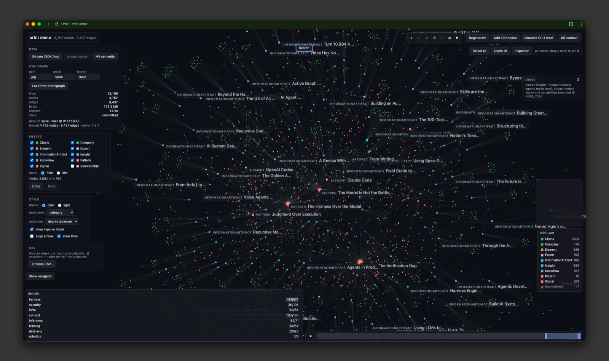

# orbit

[](https://www.npmjs.com/package/@modernrelay/orbit-react)
[](https://www.npmjs.com/package/@modernrelay/orbit-react)
[](https://github.com/ModernRelay/orbit/actions/workflows/ci.yml)
[](./LICENSE)

**A typed, declarative React library for rendering and exploring graphs with WebGL.**
Handles 100K+ node graphs. UI components included: search, tables, histograms, and more.

<p align="center">
  
</p>

## Why orbit

| Benefit | Why it matters |
|---|---|
| **Declarative end to end** | The graph is a prop — rendering, force layout, transitions, selection, and undo/redo are handled. No imperative canvas code. |
| **Built for large graphs** | GPU rendering holds 100K+ nodes interactive; incremental filtering keeps the core's per-brush cost near 1 ms at that scale, measured on a disclosed reference machine. |
| **Analyst UI included** | 13 packaged components — search, minimap, tables, histograms, timelines, legends, inspectors, and more. Headless-styleable, one import each. |
| **Testable without WebGL** | A headless core and an engine seam with a `FakeEngine` double; integration tests run in plain jsdom. |
| **Typed, honest boundaries** | Malformed data degrades with batched diagnostics — never throws mid-render. |

```bash
npm install @modernrelay/orbit-react @modernrelay/orbit-core @modernrelay/orbit-engine-cosmos
```

**Status:** `0.14.0` on npm — all five packages release in lockstep. See
[Releases](https://github.com/ModernRelay/orbit/releases) for changelogs.

## Packages

| Package | Role |
|---|---|
| `@modernrelay/orbit-core` | Headless core: validation, reconciliation, projection, the instance + store. Subpaths: `/engine` (the `GraphEngine` contract), `/testing` (`FakeEngine`, worker double). No React or engine imports. |
| `@modernrelay/orbit-react` | `<Graph/>`, `GraphProvider`, 13 packaged UI components, hooks, ref API. React 18+ peer. |
| `@modernrelay/orbit-engine-cosmos` | `CosmosEngine` — the only package that imports `@cosmos.gl/graph` (lazy-loaded at mount). |
| `@modernrelay/orbit-data` | Prepared-data adapters: rows/CSV/JSON in the root entry; Arrow and Parquet as isolated subpath entries that never reach the root bundle. |
| `@modernrelay/orbit-omnigraph` | Omnigraph server adapter: streamed export loader, `.pg` schema tooling, search service. |

## UI components

Built into `<Graph/>` itself — no extra imports:

- **DOM labels** with collision-ranked visibility and a `renderNodeLabel` custom renderer
- **Lasso selection** (freehand polygon)
- **Emphasis ring** for hover, focus, and keyboard navigation
- **Drag & pin** handles on nodes
- **`LiveRegion`** — screen-reader announcements for selection and navigation

Packaged components — each ships as its own entry point
(`@modernrelay/orbit-react/components/<Name>`), headless-styleable, wired through
`GraphProvider` context:

| Component | Entry | What it does |
|---|---|---|
| `GraphSearch` | `components/Search` | Search box with debounced queries, result list, keyboard activation |
| `GraphNavigator` | `components/Navigator` | Bounded semantic keyboard navigator (arrow/paging traversal with a11y announcements) |
| `GraphMinimap` | `components/Minimap` | Whole-graph thumbnail with a draggable viewport rectangle |
| `GraphTooltip` | `components/Tooltip` | Hover card for nodes and edges |
| `GraphInspector` | `components/Inspector` | Docked detail panel for the focused/selected entity |
| `GraphTable` | `components/Table` | Virtualized tabular view of nodes or edges, crossfilter-connected text filtering |
| `GraphHistogram` | `components/Histogram` | Crossfilter histogram — drag-brush a numeric dimension to filter the graph |
| `GraphTimeline` | `components/Timeline` | Timeline band over a temporal dimension with brush + playback |
| `GraphLegend` | `components/Legend` | Legend over any scale-valued styling channel, row-click filtering |
| `GraphToolbar` | `components/Toolbar` | Camera & simulation controls: zoom, fit, reset, pause/resume |
| `GraphContextMenu` | `components/ContextMenu` | Right-click / long-press menu on nodes, edges, and background |
| `GraphSelectionActions` | `components/SelectionActions` | Action panel that appears while a selection is non-empty |
| `GraphSimControls` | `components/SimControls` | Force-simulation tunables panel (live, no restart) |

## Features

- **Data & identity** — typed snapshots (plain objects or columnar typed arrays with transferable buffers), streaming ingest with atomic commit, batched validation diagnostics, stable id-based identity across updates.
- **Layout & simulation** — GPU force layout (cosmos.gl) or fixed coordinates, live tunables, pause/resume, zero rAF at rest.
- **Interaction** — node and edge picking, hover, drag, lasso, pins, context menus (right-click and long-press), full keyboard navigation with a11y announcements.
- **Exploration** — scope/isolate, node expansion, groups and `groupBy` with collapse to super-nodes and meta-edges, folds, semantic zoom, path emphasis, search.
- **Filtering & analytics** — crossfilter brushing with incremental O(Δ) recompute, hide/dim masks, degree metrics plus async metric columns, scales and legends.
- **Appearance** — hot-swappable dark/light themes, node image sprites, edge arrows, animated transitions.
- **Persistence & export** — deep-linkable view state, undo/redo, SVG / streamed JSON / PNG exports.
- **Scale** — measured performance gates on a disclosed real-GPU protocol, telemetry snapshots, a degradation ladder with hysteresis, and off-main-thread columnar acceptance (`execution: 'auto'`).

## Hooks & imperative API

All hooks read the instance through `GraphProvider` (or the nearest `<Graph/>`):

| Hooks | Surface |
|---|---|
| `useGraphInstance`, `useResolvedInstance` | The headless instance itself |
| `useGraphStatus`, `useGraphDiagnostics` | Lifecycle + batched diagnostics |
| `useGraphSelection`, `useGraphHover`, `useGraphEdgeHover`, `useGraphPins` | Interaction state |
| `useGraphViewport`, `useGraphSimulationRunning` | Camera + simulation state |
| `useGraphScope`, `useGraphOverlays`, `useGraphPendingExpansions` | Exploration state |
| `useGraphVisible`, `useGraphCrossfilter`, `useGraphTimeline` | Filtering state |
| `useGraphHistory`, `useGraphSearch`, `useGraphTheme` | History, search, theme |

Beyond hooks:

- **`GraphHandle`** (ref on `<Graph/>`): camera ops, `focusNode`, `emphasizeNode`,
  fold/expand/group ops, `getViewState`/`setViewState`, exports, `getPerfSnapshot`
- **`createGraphInstance`** (core): the same engine-driving instance with no React —
  everything except the React component layer works headless (data, layout,
  interaction events, exploration ops, filtering, view state, exports, telemetry)

## Development

```bash
pnpm install
pnpm check        # boundaries + anchor/pin guards + lint + types + tests + gate evaluator
pnpm demo:dev     # demo app at http://localhost:5199
pnpm --filter orbit-demo e2e            # Playwright suite
node scripts/perf-lite.mjs --tier S     # perf measurement (headful, real GPU only)
```

Ground rules enforced by `pnpm boundaries` and the test suites:

- React never touches per-node hot data; buffers stay below the adapter line
- Core imports no React; nothing outside `orbit-engine-cosmos` imports cosmos
- One `applyHostUpdate` = one store publication = at most one atomic engine commit
- Position readback is per-event, never per-tick
- Perf numbers count only from real GPUs, n≥3 runs, variance-qualified —
  software rasterizers are never accepted

Integration testing: swap the engine for the bundled double —
`import { FakeEngine } from '@modernrelay/orbit-core/testing'` — and the full
component tree runs without WebGL.
